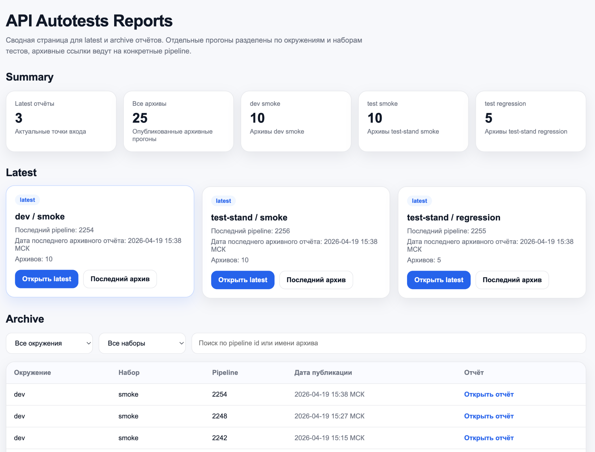
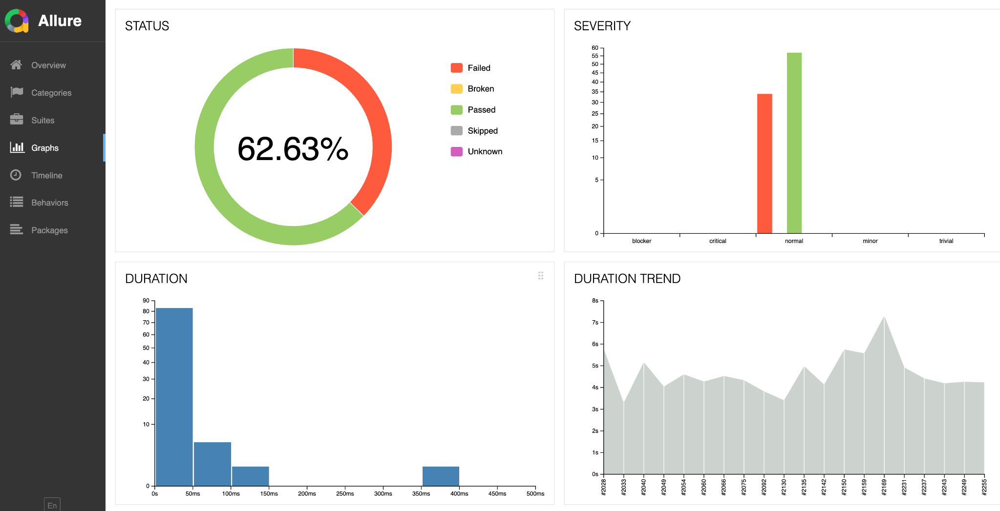
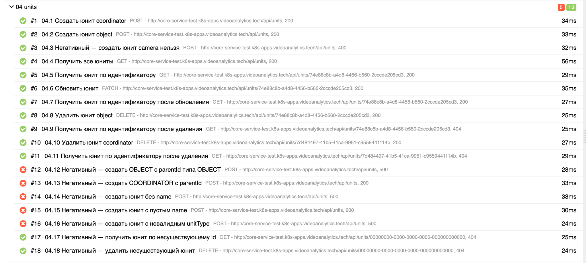
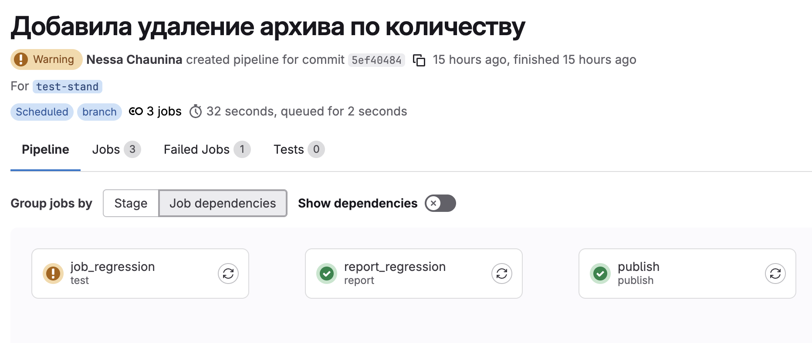

# API Autotests (Postman + Newman + Allure)

Репозиторий для автоматизированного тестирования API с использованием Postman/Newman, генерацией Allure-отчётов и реализацией CI/CD pipeline на GitHub Actions.

## Описание проекта

Реализована система автоматизированного тестирования API с поддержкой smoke и regression сценариев, построением отчётности и хранением истории прогонов.

Проект решает задачи:
- регулярной проверки стабильности API;
- визуализации результатов тестирования;
- анализа трендов качества;
- автоматизации запуска тестов через CI/CD.

## Скриншоты

### Дашборд отчётов


### Allure — обзор


### Тесты в Allure


### CI/CD pipeline


## Основной функционал

- запуск smoke и regression тестов через Newman;
- генерация отчётов в Allure;
- публикация отчётов (latest и archive);
- хранение истории прогонов;
- разделение тестов по окружениям (dev, test-stand);
- запуск тестов через GitHub Actions (push и manual trigger);
- настройка расписания запусков.

## CI/CD

Pipeline реализован на GitHub Actions и демонстрирует полный цикл:

```text
test -> artifacts
```

- test — запуск автотестов (smoke / regression);
- artifacts — сохранение результатов выполнения (reports, allure-results).

Особенности:
- smoke тесты запускаются автоматически при push в main;
- regression тесты запускаются вручную через workflow_dispatch;
- pipeline продолжает выполнение даже при ошибках тестов (continue-on-error);
- артефакты сохраняются для анализа результатов.

Важно: в публичной версии репозитория тесты выполняются в демонстрационном режиме без подключения к реальным сервисам.

## Стек технологий

- Postman
- Newman
- Allure
- GitHub Actions
- Bash / Shell
- JavaScript
- Python

## Результат

Реализована воспроизводимая и расширяемая система API-тестирования, обеспечивающая:
- автоматический контроль качества API;
- прозрачную отчётность;
- возможность анализа стабильности системы во времени.

## Ограничения публичной версии

Данный репозиторий является демонстрационной версией.

Реальные автотесты в рабочем проекте выполняются:
- во внутренней инфраструктуре;
- с использованием VPN;
- с приватными Docker-образами и секретами.

В публичной версии:
- отключены реальные интеграции;
- используются демо-данные;
- CI/CD pipeline демонстрирует архитектуру и процесс выполнения.
  
## Для резюме

Проект демонстрирует опыт выстраивания процесса контроля качества API, интеграции тестирования в CI/CD и организации отчётности для командной работы и управления релизными рисками.
